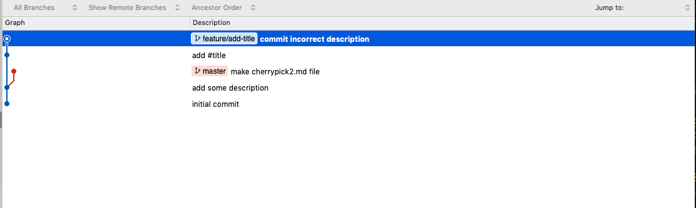
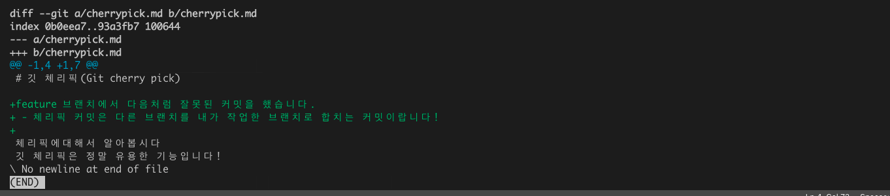
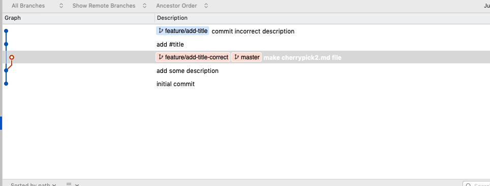
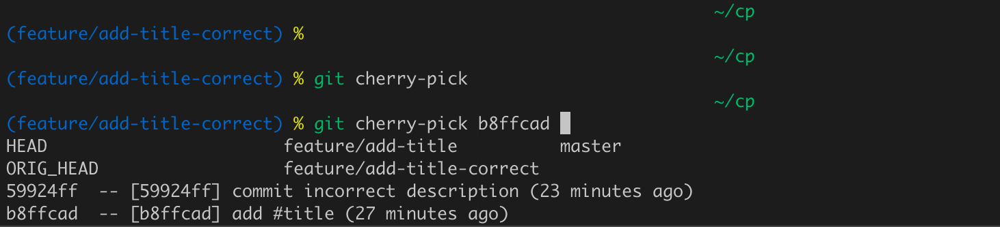
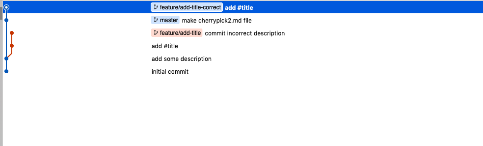
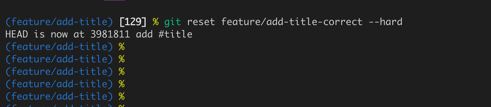
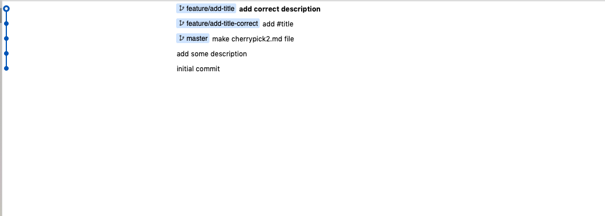
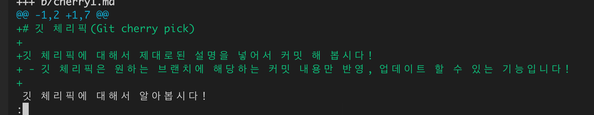

# Git 체리픽(cherry-pick) 사용법

다른 개발자와 협업하다가 브랜치가 여기저기 꼬여서  
도저히 내 코드를 살릴 수 없는 상황이 되었나요?

`rebase`또는`merge`를 해야하는데 컨플릭트를  
어디서부터 어떻게 해결해야 할지 감이 안오나요? 😟


이런 경우에 유용한 `cherry-pick`에 대해서 알아보겠습니다

## 협업하면서 당면하는 문제들

열심히 `feature`를 만들어서 `pull request`를 보냈지만 시작시점부터 설계를 잘못했거나  
코드베이스를 잘못 이해해서 리셋을 하거나 아예 새로 시작하는 마음으로  
`pull request`를 보내야 하는 경우가 있습니다

다음의 단편적인 예를 보겠습니다



`feature`브랜치의 최종커밋을 보니 다음처럼 잘못된 내용을 커밋했네요



<small>(잘 안보이시면 이미지를 클릭해주세요😅)</small>

보통의 경우라면 이 부분을 수정하거나 삭제하고  
다시 커밋을 하겠지만 `conflict`등의 여러가지 복잡한 경우가 있다고 가정하고  
작성의도에 맞게 `cherry-pick`커밋을 활용해 보겠습니다

먼저 이전 브랜치는 남겨둔 채 다음처럼  
`master`브랜치에서 `feature/add-title-correct` 브랜치로 `checkout`하고



`git cherry-pick`명령어를 통해 내가 원하는(올바른) 커밋만 가져 오겠습니다  
내가 원하는 커밋내용은 `git cherry-pick`을 입력한 뒤 `tab`을 눌러  
현재 브랜치에서 가져올 수 있는 커밋들을 자동완성 된 히스토리를 통해 볼 수 있습니다

```shell
git cherry-pick b8ffcad(커밋넘버)
```



명령어를 실행하고 히스토리를 보니 내가 원하는 커밋이  
새로운 브랜치에서 정상적으로 들어온 것이 보이네요



단순하고 간단한 예시지만 `cherry-pick commit`의 유용성이 느껴지시나요?👍

이후에는 새로 만든 브랜치에서 다시 `pull-requeset`를 보내도 되겠지만  
원격으로(GitHub 등) 이미 보낸 `request`를 `close`하고  
다시 새로운 요청을 만드는 것은 번거롭고 깔끔하지 못한 방법이므로  
기존 브랜치로 `checkout` 한 뒤 새로운 브랜치에 `reset` 해보겠습니다

```shell
git checkout feature/add-title
git reset feature/add-title-correct --hard
```

여기서 `--hard` 옵션이 없을 경우 기존 브랜치에서 작업한 내용들이  
`unstaged`된 채 남아 있습니다



이렇게 된다면 내가 원하는 커밋은 `feature/add-title-correct`에서 이미 모두  
커밋이 된 상태이므로 원하는 내용을 수정하거나 추가한 뒤  
같은 브랜치에서 `pull-request`를 보낼 수 있겠네요!



(히스토리 결과)

```shell
git diff master
```



(diff 결과)
