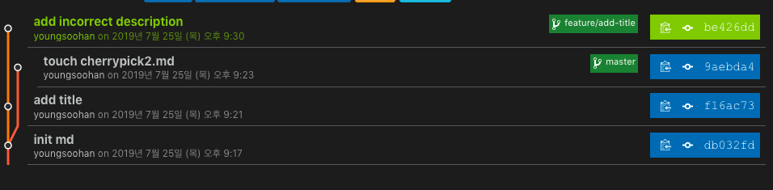
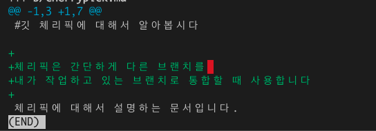

# Git 체리픽(cherry-pick) 사용법

다른 개발자와 협업하다가 브랜치가 여기저기 꼬여서 도저히 내 코드를
살릴 수 없는 상황이 되었나요?

`rebase`또는`merge`를 해야하는데 컨플릭트를  
어디서부터 어떻게 해결해야 할지 감이 안오나요? 😟

이런 경우에 유용한 `cherry-pick`에 대해서 알아보겠습니다

## 협업하면서 생기는 여러가지 문제들

### 1. `PR` 수정사항이 많아 브랜치를 새로 만들어서 시작할 때

열심히 `feature`를 만들어서 `pull request`를 보냈지만 시작시점부터 설계를 잘못했거나, 코드베이스를 잘못 이해해서 아예 브랜치를 새로 만들어서 다시  
`pull request`를 보내야 하는 경우가 있습니다

`vscode`의 `git history`를 통해 다음을 보시죠

`feature`브랜치의 최종커밋을 보니 다음처럼 잘못된 내용을 커밋했네요

보통의 경우라면 이 부분을 수정하거나 삭제하고  
다시 `PR`을 보내겠지만 여기서는 작성의도에 맞게 브랜치를 새로 만들어서  
내가 원하는 커밋만 취하는 방법으로 다시 커밋을 해보겠습니다(cherry-pick)
