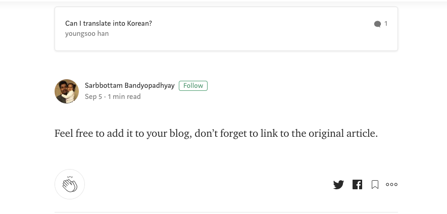
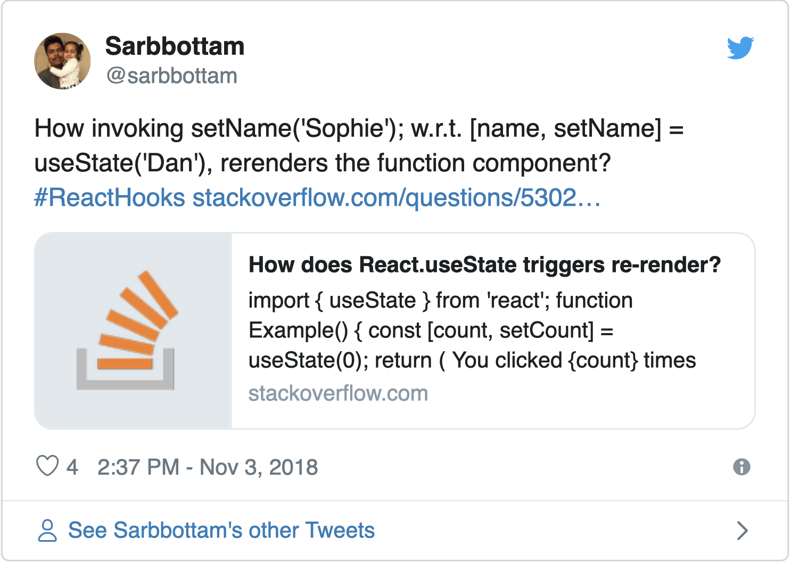
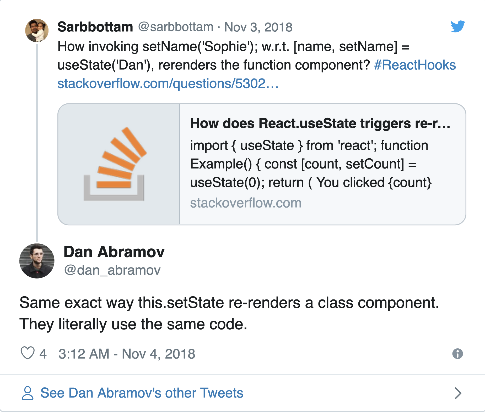

다음 글은 `react-hooks`의 동작원리를 알아보기 위해 원작자 [Sarbbottam Bandyopadhyay](https://medium.com/@sarbbottam) 의 글을 번역한 글입니다

<figure>
  
  <figcaption>Thank you! Sarbbottam</figcaption>
</figure>

원본은 [medium](https://medium.com/swlh/how-does-react-hooks-re-renders-a-function-component-cc9b531ae7f0)에서 확인 하실 수 있습니다

⚠️ 이 글은 `react-hooks`를 어떻게 활용하가에 대한 글이 아닙니다. 이미 `react-hooks`를 설명하는 많은 훌륭한 자료들이 많습니다. 이 포스트에서는 `react-hooks` 의 매커니즘, 화면 뒤에서 `react-hooks`가 작동하는 방법, `functional component`의 state 를 유지 하는방법, `function component` 를 다시 렌더링 하는 방법에 대한 이해를 설명하려고 합니다. `react` 또는 `react-hooks` 시작하기 위해 자료를 찾고 있다면 공식 문서부터 시작하는 것이 좋습니다. [the official React documentation](https://reactjs.org/docs/getting-started.html).

참고로, 저는 `react-hooks`의 실제 구현에는 익숙하지 않습니다. `react-hooks` 의 실제 구현이 이 글에서 설명한 접근법과 정확하지는 일치 하지 않지만 비슷할 것이라고 생각합니다.

<figure>
  
  <figcaption>Photo by<a href="https://unsplash.com/@bundo?utm_source=unsplash&utm_medium=referral&utm_content=creditCopyText">Bundo Kim</a> on <a href ="https://unsplash.com/search/photos/hooks?utm_source=unsplash&utm_medium=referral&utm_content=creditCopyText">Unsplash</a>
  </figcaption>
</figure>

더 이상 고민하지 말고 시작합시다.

`react-hooks` 는 2018 년 10 월 25 일 React Conf에서 공개적으로 발표되었습니다. 저는 `react-hooks` 사용하여 `function component` 의 state를 유지할 수 있다는 사실에 놀랐습니다. 처음부터 저는 그것에 매료되었지만, 그것은 저에게 마법처럼 보였습니다. 저는 `hook`에 의해 반환 된 함수를 호출하는 것이 어떻게 다시 컴포넌트를 렌더링을 하는지 이해할 수 없었습니다. 그때 코드를 파고 들었지만 아무런 의미가 없었고 내가 생각할 수있는 최선을 다했으며 StackOverflow 질문을 올렸습니다.

<a href="https://stackoverflow.com/questions/53024488/how-does-react-usestate-triggers-re-render?source=post_page-----cc9b531ae7f0----------------------">
<figure>
  
  <figcaption>javascript - How does React.useState triggers re-render? - Stack Overflow</figcaption>
</figure>
</a>

게시물에 답글이 있지만 이해 할 수 없었습니다. 며칠 후, StackOverflow 게시물을 해시 태그 `#ReactHooks`로 트윗했고, 이는 제가 다음으로 할 수 있는 가장 좋은 행동이라고 생각했습니다.

<a href ="https://twitter.com/sarbbottam/status/1058593868046774272?ref_src=twsrc%5Etfw%7Ctwcamp%5Etweetembed&ref_url=https%3A%2F%2Fcdn.embedly.com%2Fwidgets%2Fmedia.html%3Ftype%3Dtext%252Fhtml%26key%3Da19fcc184b9711e1b4764040d3dc5c07%26schema%3Dtwitter%26url%3Dhttps%253A%2F%2Ftwitter.com%2Fsarbbottam%2Fstatus%2F1058593868046774272%26image%3Dhttps%253A%2F%2Fi.embed.ly%2F1%2Fimage%253Furl%253Dhttps%25253A%25252F%25252Fpbs.twimg.com%25252Fprofile_images%25252F551941907350163457%25252FTAaQFKXs_400x400.jpeg%2526key%253Da19fcc184b9711e1b4764040d3dc5c07">
<figure>
  
</figure>
</a>

`#ReactHooks` 해시 태그를 사용하는 것이 Dan Abramov의 관심을 끈 것 같았습니다. 그는 `re-rendering` 메커니즘이 클래스 Component와 동일하다고 답변했습니다.

<a href="https://twitter.com/dan_abramov/status/1058784045658791936?ref_src=twsrc%5Etfw%7Ctwcamp%5Etweetembed&ref_url=https%3A%2F%2Fcdn.embedly.com%2Fwidgets%2Fmedia.html%3Ftype%3Dtext%252Fhtml%26key%3Da19fcc184b9711e1b4764040d3dc5c07%26schema%3Dtwitter%26url%3Dhttps%253A%2F%2Ftwitter.com%2Fdan_abramov%2Fstatus%2F1058784045658791936%26image%3Dhttps%253A%2F%2Fi.embed.ly%2F1%2Fimage%253Furl%253Dhttps%25253A%25252F%25252Fpbs.twimg.com%25252Fprofile_images%25252F1096807971374448640%25252FrVCDhxkG_400x400.png%2526key%253Da19fcc184b9711e1b4764040d3dc5c07">
<figure>
  
</figure>
</a>

답변이 도움이되었지만 `re-rendering`을 트리거하는 방법을 이해할 수 없었습니다. 그리고 React의 Class Component가 `this.setState`를 호출하면 다시 렌더링을 시작하는 방법을 보고 추론 했습니다.

📌 다음 예제를 봅시다.

```js
const { render, Component } = OverReact
class ExtendedComponent extends Component {
  constructor(props) {
    super(props)
    this.state = {
      counter: 0,
      name: 'foo',
    }
  }

  plusOne() {
    const { state: previousState } = this
    let { counter } = previousState
    counter = counter + 1
    this.setState(Object.assign(previousState, { counter }))
  }
  updateName(name) {
    const { state: previousState } = this
    this.setState(Object.assign(previousState, { name }))
  }

  render() {
    const { counter, name } = this.state
    console.log(`rendered, counter: ${counter}, name: ${name}`)
  }
}
// initial render
render(ExtendedComponent)
```

⚠️ 우리는 React가 아닌 `OverReact`의 `render`와 `Component`를 사용하고 있습니다. `OverReact`를 구현하고 `this.setState`를 호출하여 컴포넌트를 다시 렌더링하는 방법을 알아 봅니다. 또한 `ExtendedComponent`의 렌더링 함수는 HTML을 반환하지 않고, 현재 상태를 출력합니다.

💻 우리가 이미 알고있는 정보로 `render` 함수와 `Component Class`를 구현해 봅시다 :

- render 함수는 Component를 받아서 렌더링합니다.

- Component 클래스에는 this.props를 설정하는 생성자와 re-rendering을 트리거하는 setState 메소드가 있습니다.

```js
// extreamly simplified implementation
function render(Component) {
  // ToDo
  // render the Component
}
class Component {
  constructor(props) {
    this.props = props
  }
  setState(state) {
    this.state = state
    // ToDo
    // triggers re-render
  }
}
OverReact = {
  render,
  Component,
}
```

Component class의 `OverReaact.render` 함수와 `setState` 함수는 `ExtendedComponent`의 `render` 함수를 실행 할 수 있어야 합니다.

위의 지식으로 ToDos를 구현해 봅시다.

```js
// extreamly simplified implementation
function render(Component) {
  // create an instance of the passed Component
  const instance = new Component()
  // invoke the render method of the instance
  instance.render()
  // return the instance back
  // so that we can invoke the other method of the instance
  // like so:
  // const instance = render(ExtendedComponent);
  // instance.someInstanceMethod();
  return instance
}
class Component {
  constructor(props) {
    this.props = props
  }
  setState(state) {
    this.state = state
    // invoke the render method of the instance
    this.render()
  }
}
OverReact = {
  render,
  Component,
}
```
